# Database schema

SQLite at `data/cricket_intelligence.db`. SQLAlchemy ORM models in
[`src/storage/db.py`](../src/storage/db.py); Pydantic input/output schema
in [`src/intelligence/schema.py`](../src/intelligence/schema.py).

## ER diagram

```mermaid
erDiagram
    MATCHES ||--o{ BALLS : "has many"
    BALLS  ||--o{ GROUND_TRUTH : "has corrections"

    MATCHES {
        string  match_id        PK "e.g. T20-IndvsEng-IndBat"
        string  format             "T20 / ODI / Test"
        string  team_a
        string  team_b
        string  venue
        string  date
        string  match_date         "ISO date"
        string  day_or_night       "day / night / day_night / unknown"
        string  source_url         "cricsheet / youtube / etc."
        string  video_path
        datetime created_at
    }

    BALLS {
        string ball_id     PK "match_id_i{innings}_{over}_{ball}"
        string match_id    FK
        int    innings        "1-4"
        int    over_number    "0-indexed"
        int    ball_number    "1-indexed within over"

        string bowler_name
        string batsman_name

        string bowler_type    "pace / spin / unknown"
        string line           "off / middle / leg / outside_off / ..."
        string length         "yorker / full / good / short / ..."
        string variation      "bouncer / cutter / slower / yorker / none"
        string bounce_behavior "low / normal / steep / unknown"
        string movement       "swing / seam / turn / none / unknown"
        string swing_direction "in_swing / out_swing / none / unknown"
        string swing_type     "conventional / reverse / none / unknown"
        string spin_direction "off-spin / leg-spin / none / unknown"
        string ball_age_phase "new_ball / old / reverse_window / unknown"
        string bowler_crease  "over_the_wicket / round_the_wicket / unknown"
        float  bowling_speed_kmph

        string shot_type      "cover_drive / pull / sweep / ... / unknown"
        string footwork       "front_foot / back_foot / unknown"
        string contact_quality "clean / edge / miss / pad / unknown"
        string shot_direction "16-position field map / unknown"
        string edge_type      "inside / outside / top / bottom / none"
        string batsman_handedness "left / right / unknown"

        string outcome        "dot / 1 / 2 / 3 / 4 / 6 / wicket / wide / no_ball"
        int    runs_scored    "batter runs (not extras)"
        string dismissal_type "caught / bowled / lbw / ... / none"
        string dismissal_fielder
        string phase          "powerplay / middle_overs / death / unknown"

        float  confidence_bowler_type
        float  confidence_line
        float  confidence_length
        float  confidence_shot_type
        float  confidence_outcome
        float  confidence_contact

        string clip_path
        string clip_start_time
        string clip_end_time
        text   raw_description "[cricsheet]... or Gemini's free-text"
        text   pose_features   "JSON pose vector"
        bool   is_reviewed
        string reviewed_by
        text   review_notes
        datetime created_at
        datetime updated_at
    }

    GROUND_TRUTH {
        int      id              PK "AUTO"
        string   ball_id            "→ balls.ball_id (no FK constraint)"
        string   field_name         "which column was corrected"
        string   old_value
        string   new_value
        string   coach_id           "default anonymous"
        text     pose_features_snapshot
        string   source             "ui / import / etc."
        datetime timestamp          "default CURRENT_TIMESTAMP"
    }
```



## Field-source provenance (single-table convention)

The `balls` table stores both **Cricsheet ground-truth** records and
**Gemini-extracted** records in the same row layout. Source is recoverable
from the data itself — there is no separate `source` column today.

| Source | How to identify the row |
|---|---|
| **Cricsheet** | `raw_description LIKE '[cricsheet]%'`. Technique fields all `unknown`/`none`. Confidence fields all `0.0`. Player names use Cricsheet canonical form (`RG Sharma`, `RR Pant`). |
| **Gemini** | `raw_description` is free-text from the model. Technique fields populated. Confidence fields populated. Player names use broadcast form (`Rohit Sharma`, `Rishabh Pant`). |
| **Coach correction** | Any field whose value disagrees with both — see the `ground_truth` audit log. |

Future technique-only Gemini enrichment runs as an UPDATE on Cricsheet rows
by `ball_id`: WHO/WHAT/RUNS stay from Cricsheet, technique fields get
filled in from the per-ball Gemini call. This is why a single table works
better than a two-table split — the join key already exists.

## ball_id format

```
{match_id}_i{innings}_{over}_{ball_number}
```

Example: `T20-IndvsEng-IndBat_i2_0_1` = match `T20-IndvsEng-IndBat`,
innings 2 (India batting), over 0 (the 1st over), ball 1 (the 1st ball
of that over).

The `i{innings}` segment is critical — without it, the same `(over, ball)`
pair from both teams' innings would collide on PK.

## Operational notes

- All ball-level enums are stored as their **string values** (e.g.
  `"caught"`, `"powerplay"`), not integers. Source enums in
  [`src/intelligence/schema.py`](../src/intelligence/schema.py).
- The schema has been extended several times via `ALTER TABLE`-style
  migrations. The `pose_features` and Tier-1 fields
  (`shot_direction`, `dismissal_type`, etc.) were added incrementally;
  older rows pre-dating those columns will have NULL there.
- `ground_truth.ball_id` has no formal FK constraint — corrections may
  outlive their balls if a match is deleted+re-imported.
